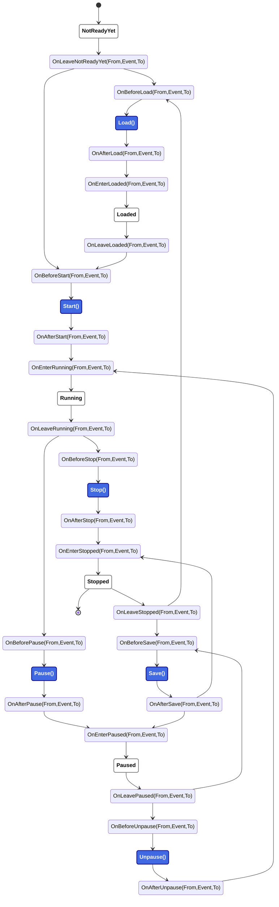

```mermaid
stateDiagram-v2
classDef States fill:white,color:black,font-weight:bold,stroke-width:2px,stroke:grey
classDef Events fill:royalblue,color:white,font-weight:bold,stroke-width:2px,stroke:darkblue


[*] --> NotReadyYet:::States
NotReadyYet --> OnLeaveNotReadyYet(From,Event,To)
OnLeaveNotReadyYet(From,Event,To) --> OnBeforeLoad(From,Event,To)
OnBeforeLoad(From,Event,To) --> Load():::Events
Load() --> OnAfterLoad(From,Event,To)
OnAfterLoad(From,Event,To) --> OnEnterLoaded(From,Event,To)
OnEnterLoaded(From,Event,To) --> Loaded:::States
Stopped --> OnLeaveStopped(From,Event,To)
OnLeaveStopped(From,Event,To) --> OnBeforeLoad(From,Event,To)
OnLeaveNotReadyYet(From,Event,To) --> OnBeforeStart(From,Event,To)
OnBeforeStart(From,Event,To) --> Start():::Events
Start() --> OnAfterStart(From,Event,To)
OnAfterStart(From,Event,To) --> OnEnterRunning(From,Event,To)
OnEnterRunning(From,Event,To) --> Running:::States
Loaded --> OnLeaveLoaded(From,Event,To)
OnLeaveLoaded(From,Event,To) --> OnBeforeStart(From,Event,To)
Running --> OnLeaveRunning(From,Event,To)
OnLeaveRunning(From,Event,To) --> OnBeforeStop(From,Event,To)
OnBeforeStop(From,Event,To) --> Stop():::Events
Stop() --> OnAfterStop(From,Event,To)
OnAfterStop(From,Event,To) --> OnEnterStopped(From,Event,To)
OnEnterStopped(From,Event,To) --> Stopped:::States
OnLeaveRunning(From,Event,To) --> OnBeforePause(From,Event,To)
OnBeforePause(From,Event,To) --> Pause():::Events
Pause() --> OnAfterPause(From,Event,To)
OnAfterPause(From,Event,To) --> OnEnterPaused(From,Event,To)
OnEnterPaused(From,Event,To) --> Paused:::States
Paused --> OnLeavePaused(From,Event,To)
OnLeavePaused(From,Event,To) --> OnBeforeUnpause(From,Event,To)
OnBeforeUnpause(From,Event,To) --> Unpause():::Events
Unpause() --> OnAfterUnpause(From,Event,To)
OnAfterUnpause(From,Event,To) --> OnEnterRunning(From,Event,To)
OnLeavePaused(From,Event,To) --> OnBeforeSave(From,Event,To)
OnBeforeSave(From,Event,To) --> Save():::Events
Save() --> OnAfterSave(From,Event,To)
OnAfterSave(From,Event,To) --> OnEnterPaused(From,Event,To)
OnAfterSave(From,Event,To) --> OnEnterStopped(From,Event,To)
OnLeaveStopped(From,Event,To) --> OnBeforeSave(From,Event,To)
Stopped --> [*]
```